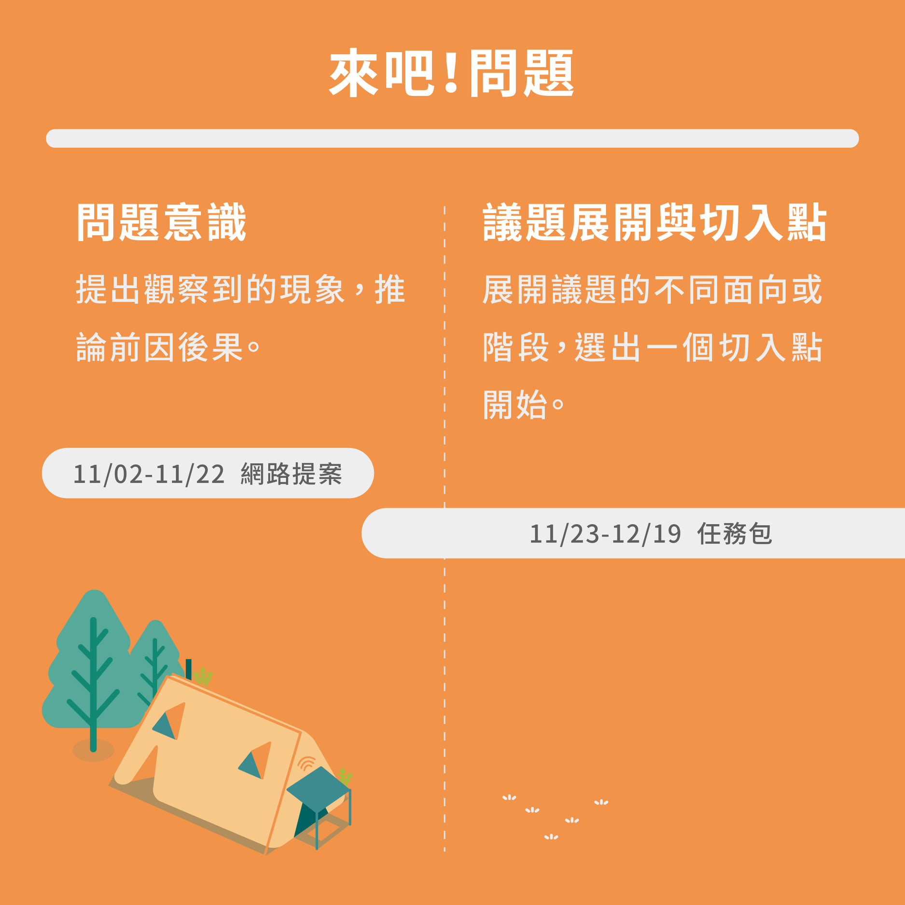
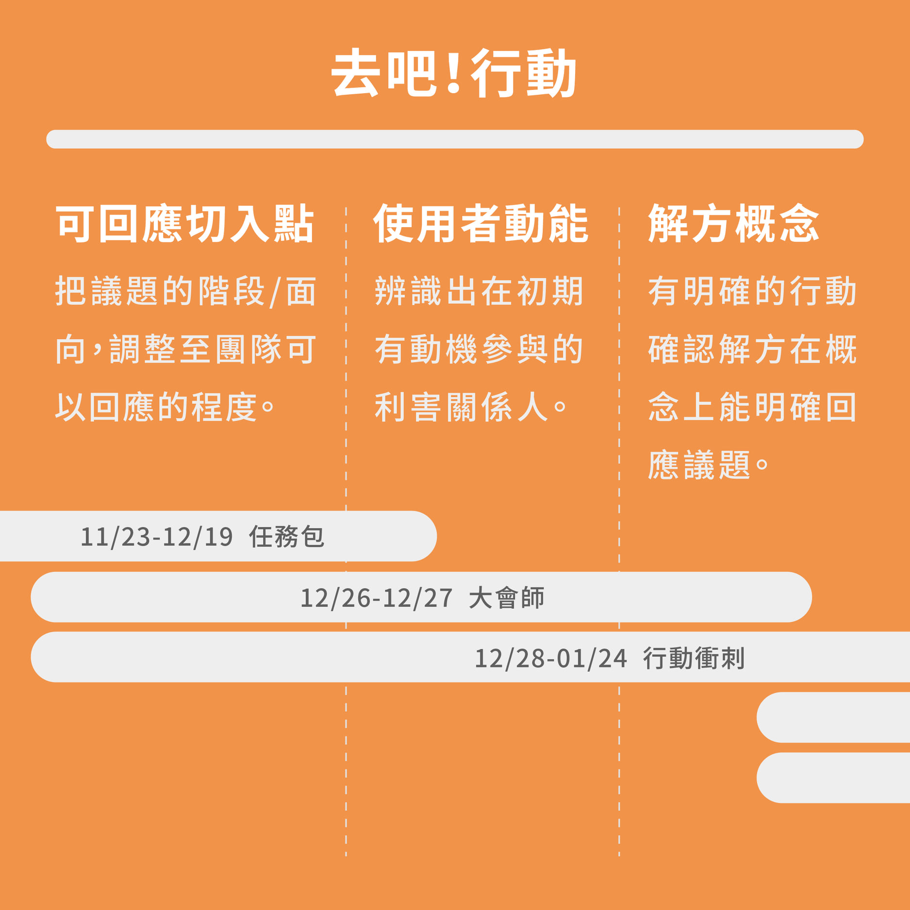
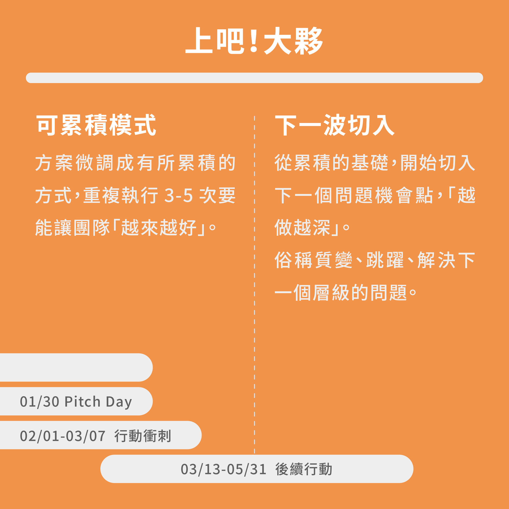

# 行動架構設計

### 關於迴響團隊的行動軌跡：

行動軌跡指的是在過往迴響團隊大多會經歷的階段，幫助判斷團隊行動計畫大概在什麼階段？下一階段可能會是什麼？該獲取什麼樣的資源？該如何設定目標？

每年，迴響的行動架構設計一定會被我們拿出來檢視，有效的行動架構會指引工具開發的價值、也可以讓團隊清楚地聚焦目標。相反的，那些讓團隊感到困惑、其實做不到的，就是那些會被我們特別拿出來優化的環節。

這個行動軌跡並不是行動的「正確解答」，只是提供我們一個框架來理解團隊與協助團隊設定目標。

以下目前我們對於剛展開行動的團隊（大約行動 0-12 個月）的階段描述，圖中的時間軸與案例，為 2020-2021 年迴響計畫的案例。

## 【來吧！問題】所有行動始於一句提案。

我們如何承認眼前**感覺怪怪的**，就是一個問題？而這個問題，我該如何闡述、並讓社會大眾同樣認為**這件事值得被討論**？

第一步很簡單，提出問題之後，看見與之相關聯的議題，那麼我們該如何選擇第一個切入點？

### 案例分享 2020 No.172 SAVEE 

#### **第一句提問：我們如何能夠積極預防私密影像外流呢？**

No.172 SAVEE 是關心私密影像外流議題的團隊，經過任務包的引導，與重要的關係人訪談，發現一個極其抽象、卻又關鍵的「感受」。

**重要關係人：**曾觀看外流私密影像的同學、曾受理過私密影像外流案件的警察、以及公民老師。

**發現：**由於年輕族群普遍不了解「私密影像外流」的嚴重性、覺得自己**不具有 「道德制高點」**的立場來阻止散播；  
而教師們即便發現有嚴重性，也會因為「 **難以從現有課綱找到延伸點**」、「**考試導向教學**」、「**修課對象限制**」等因素，造成此議題較難融入現有公民課中，並把正確觀念觸及到每一位學生。

**可執行的切入點：**團隊希望能從「整個社會的第一步」著手行動－－－更著重在「國高中生」對於私密影像外流的預防與法律知識上的補充。

**延續發想的方法：**

* 為了要能夠吸引國高中生，團隊將議題的切入點鎖定在以遊戲化的方式來增加觸及人數
* 從桌遊的設計中，讓國高中生以情境式的方式，\#體驗加害人與被害人的感受，進一步在生活中帶來影響力。

## 【去吧！行動】完美行動根本不存在，迭代、優化使之完整。 

實際在社會裡展開行動，會讓我們蒐集到許多資訊，得以調整一開始切入議題的觀點、或是打開更多天線認識盲點、優化手段，直到提出逐步完整的解決方案。

### 案例分享 2020 No.157 失敗練習 

No.157 失敗練習，是一個探索如何協助大學生處理「**內在對於成功的理解**」與「**社會對於成功的期待**」有所衝突時所產生的情緒。  
　　  
**議題切入點：**「為什麼頂大生就應該要很厲害？」、「為什麼身邊的同儕總是這麼有目標、有理想？」這些想法引發的情緒是頂尖大學生常常面臨的問題。  
  
**行動方法：**團隊透過工作坊的方式，讓更多大學生的心聲，可以被聽見。  
　　  
工作坊的環節，開發了「失敗重擬」、「好時光日誌」來幫助頂大學生對過去做整理與反思，並透過「故事交換」、「深度交流」的機制，讓同儕可以坐下來聊聊，抒發自己內在的真實感受與想法。  
　　  
**行動歷程：**團隊在短短的一個月中，舉辦三場工作坊，影響了 30 位頂大學生，而參加完的學生高達九成以上認為活動對他們來說非常有幫助，**從中獲得壓力與情緒的釋放**，甚至有幾位學生連續參加好幾場工作坊。

## 【上吧！大夥】我有的是經驗！下一步，就是重複！就是累積！就是再踹！

來，如果你會看到這，讓我們一起好好反思：「為什麼凡事都叫我先給商業模式？為什麼大家都要問我原理？論述？」

 不好意思，青年迴響給的，是行動。 再微小的行動，有用了，我們就來搞懂為什麼。

### 案例分享 2020 No.098 漂泊俱樂部 

No.098 漂泊俱樂部，是一個關心高關懷青少年的團隊，希望能建立高關懷青少年與社會良性互動、對話的橋樑。  
　　  
**行動歷程：**在實驗行動的過程中，團隊嘗試了讓高關懷青少年**與大眾做交換日記**、**觀察高關懷青少年參與一般休閒活動**、 **訪談陪伴過高關懷青少年的組織**等。  
　　  
**收斂的方案：**「共備料理」，讓高關懷青少年在與大眾共同完成料理的過程中，自然而然產生互動與對話，並在完成後一起發送料理給無家者。  
　　  
**大議題裡的關鍵發現：**高關懷青少年，在特別某一種狀況下，比較容易能與人開啟對話：**不是單純為了交流而產生的互動**；  
  
同時，會因為和陌生參與者，有共同要達成的新目標，**會獲得成就感和喜悅**，推測這些感受，都能推動高關懷青少年的意願，有了下一次還想試試看的動能；  
　  
並且，讓陌生參與者，從這樣的活動中，更能以沒有標籤的眼光，自在地認識高關懷青少年，形塑出團隊心目中的良善氛圍。  
　　  
**如何放大？**：確定方案走向後，團隊下一步期待能在共備料理的最前期，號召更多大眾志工一起與高關懷青少年共同設計菜單，擴大能參與互動的大眾數量，也讓更多高關懷青少年能夠有機會與社會開啟良性的對話。

## 後記：

此行動架構為 2020-2021 版本，經過三屆的累積已經精準許多，還是有些根據今年行動團隊的實際狀況有些發現，尚未更新，以下提供參考：

* 2020 開始，考量到團隊的進度不一（因為議題特性、執行能力），將活動中個階段的目標調整為「範圍」，而非一個明確的點，也就是在圖中你會看到即使是兩天的活動，行動的階段也是一個範圍。
* 「去吧！行動」中的三個子階段，彼此之間其實是連貫的，很可能一個解方概念驗證錯誤，這整段都會重新構想（回到可回應切入點）
* 從「去吧！行動」到「上吧！大夥」階段，實際上所花費的時間比想像中的長，前兩個階段大約在 1-2 個月的行動衝刺可以有很明確的收穫。但連續衝刺 2-3 個月後，團隊其實比起推進行動，更需要的是以下
  * 整體團隊動能：經過幾次轉向，可能因為議題的了解或者是點子的方向，已經不是每個成員都一樣有興趣的
  * 成員職涯發展：迴響參加者主要為 20-25 歲，3-6 個月之後，容易遇到個人生涯選擇，也會影響團隊行動
  * 累積信心：衝刺之後，團隊需要的也許是在已經成功幾次的行動中在反覆多做幾次，或許不會有突破性的收穫，但讓團隊對於自己的行動是肯定的，是很重要的動力來源。急於發展，可能會讓團隊在新行動中有過多的風險要承擔。

迴響對於發展這些行動的軌跡、工具非常有興趣，若你對以上的內容有些延伸的疑問或回饋，歡迎直接聯絡我們！

