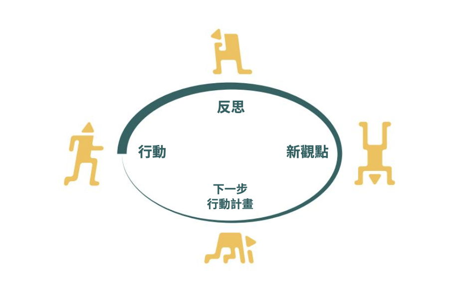
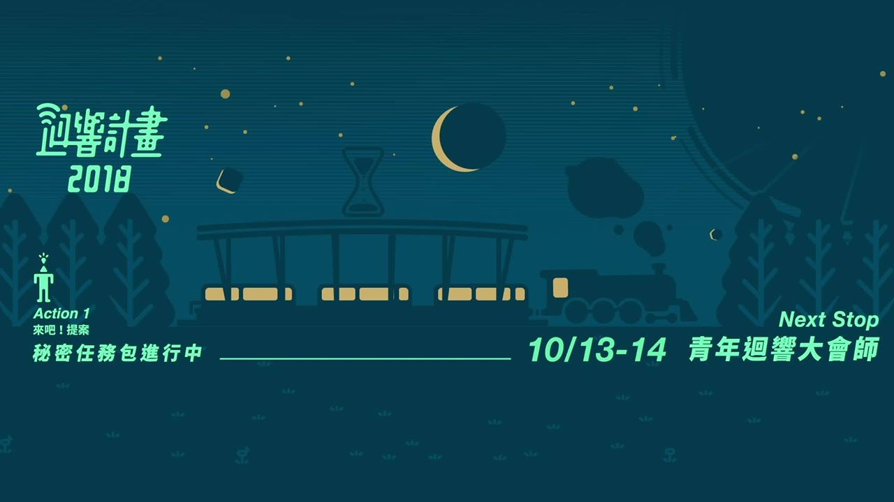

# 2018 年，是所有東西都想要更好的一屆

第一次的「再來一遍」，有許多東西想留下，也有許多東西想改變，我們仍然在摸索的路上：什麼才是最好的作法？

* **確立迴響三大精神**
  * 從「指引性」的考量出發，精神是要讓人在什麼都沒有的狀況，還可以嚐試些什麼的內容，把精神之一從「行動從不簡單，但會很值得」修正為「將失敗化為學習的機會」，到 2021 年為止都沒有再改動，你可以在迴響的各式文案、活動設計找到這些概念。
* **行動迴圈開始變得清楚**
  * 行動迴圈的架構重新確認，有代表「動起來」概念的「行動」、「反思」、「發想」，以及代表階段成果的「新資訊」、「新觀點」、「行動方案」，對於工具開發、團隊每次開會/行動的目標都提供更清楚的指引。
  *   2017 年版本的行動迴圈由四個元素組成
  *   2018-2021 年版本的行動迴圈，改為「3 點 3 線」，點代表的是很明確可以溝通的結論，線則是具體要做的事情。  
* **大幅增加教練人數，讓更多團隊可以有效行動**：

  * 從 5 位教練團提升到 15 位教練團，本來只有到最後階段的 10 組團隊才會有教練的協助，變成從任務包開始，都有教練貫穿整個計畫。除了更有效地讓迴響的行動工具落地，對執行團隊來說，我們也可以清楚的了解 30 組團隊在行動過程的心聲、感動或者是對計畫的不適應。

* **以積分制取代一次性篩選**：

  *  「團隊的去留，不該是一時一刻的簡報來決定的」，當初秉持著這個信念，嘗試在計畫各處都新增團隊的紀錄，包含行動的成果、反思的能力、團隊經營的狀況、團隊互評、行政配合的程度、大眾評分...所有利害關係人都參與了。
  * 整體來說，的確克服了既有簡報評選的問題，在評分與評語都透明公布的狀況也帶給團隊很清楚的「公平性」。但相對的行政複雜性，還有不同人平分之間的權重問題，帶給執行團隊不小的挑戰，同時也留給執行團隊一個核心的問題：公平是否代表真實？
  * 積分制因為 2019 年的計畫規模較小，也沒有明確的資源分配問題，因此沒有延續。

* **更盛大的行動節，也是對執行團隊更大的壓力、對行動團隊更多的目標**：

  * 從原本僅有最終 10 組團隊參與行動節，這屆迴響讓 30 組團隊通通參展了，找了華山紅酒廠的大型場地，讓足夠多的團隊與社會有更多元的對話
  * 這年的實體活動，執行團隊都是以個人代表作的心態在製作，展場的地圖用立體的裝置呈現，每一個裝置都由成員手工製作完成。
    * 小補充：當年的大會師，也是歷年來最豪華的實體活動，活動現場區分成多個區塊，每個區塊都有獨立的風格。
  * 盛大的實體活動，也帶給執行團隊很大的執行壓力，過多的期待要執行，雖然的確在活動現場帶給行動團隊驚喜與感動，但過程的傷害也影響了執行團隊的留任率。
  * 對於行動團隊來說，的確促成很多與大眾的對話，但因為團隊的議題、行動階段多元，不是所有團隊在此刻都最需要曝光，對這種團隊，最終發表會與行動節變成分散心力的的兩個目標，影響動能。

* **第一次做迴響研究，模糊地從模糊中找線索**
  * 計畫結束後的半年，第一次停下腳步，試著了解「迴響計畫到底做對什麼」，第一次做研究，對於研究目標的敏感度不夠、對於研究方法熟練度也不足，因此研究結果對於公開溝通、內部指引策略的效果有限。
  * 但從研究中，仍清楚發現「行動工具」的使用，會影響團隊與教練間溝通的聚焦程度，影響下一屆開發迴圈工具包的基礎。







### 

