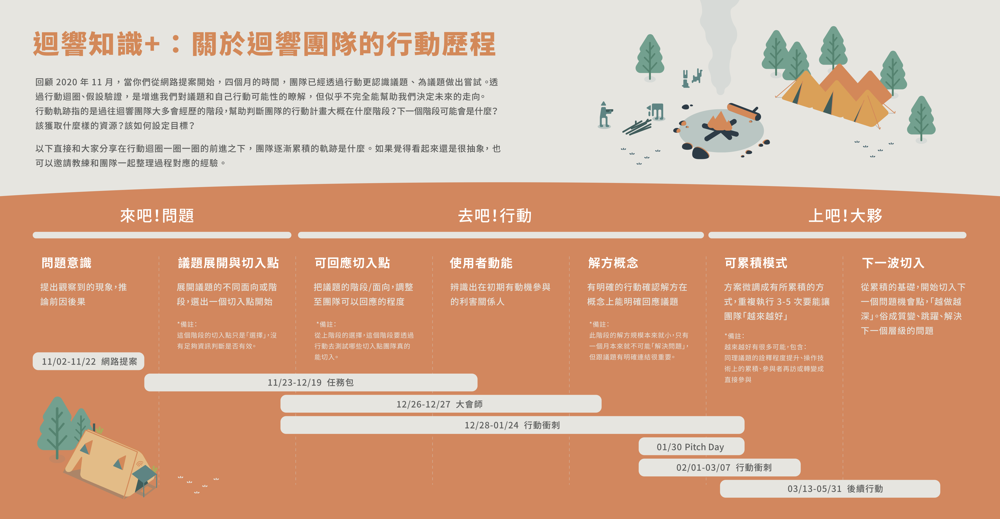

# 行動階段

### **三大階段提供團隊短期目標**

[行動迴圈](../hang-dong-hui-quan.md)一圈一圈的要轉去哪裡呢？  
**迴響根據團隊的發展階段，提供了基本的階段目標，讓團隊可以有意識的前進。**

「你的商業模式是什麼？」是一個重要的問題，代表團隊能提出一個長期經營的計畫、考量過足夠的面向。

但是，對於一個才剛起步的團隊，根本沒有足夠的資訊回應這個問題，若急著用很多自己也不確定的想法來填滿整個商業模式圖，反而會讓團隊形成「外表堅強，內心恐懼」，隨時會崩塌。

### 那剛起步的團隊，會經過哪些階段？：

迴響不同階段的目標，希望可以協助團隊以合理的節奏逐步發展，我們分為

**【來吧！問題】：**這個階段還不用急著解決問題，重點是在更了解問題，並找到重要的幾個切入點

**【去吧！行動】：**是團隊發揮創意去試著解決問題的時刻，重點不在「完全解決」，而是可以處理一小部分，「先看到可能性」，並可以從中持續累積、促成和外部的交流與合作。

**【上吧！大夥】：**是團隊找到了一個切入方式後，想辦法聚集更多能量，一邊推動議題、一邊捲入更多資源的階段。

以上三大階段是過往迴響團隊大多會經歷的階段，幫助判斷團隊的行動計畫大概在什麼階段？下一階段可能會是什麼？該獲取什麼樣的資源？該如何設定目標？能協助團隊聚焦方向。

### 讀前提醒

每年，迴響的行動架構設計一定會被我們拿出來檢視，有效的行動架構會指引工具開發的價值、也可以讓團隊清楚地聚焦目標。相反的，那些讓團隊感到困惑、其實做不到的，就是那些會被我們特別拿出來優化的環節。

這個行動軌跡並不是行動的「正確解答」，只是提供我們一個框架來理解團隊與協助團隊設定目標。

#### 接下來，你也可以看看每個階段的說明與案例：







