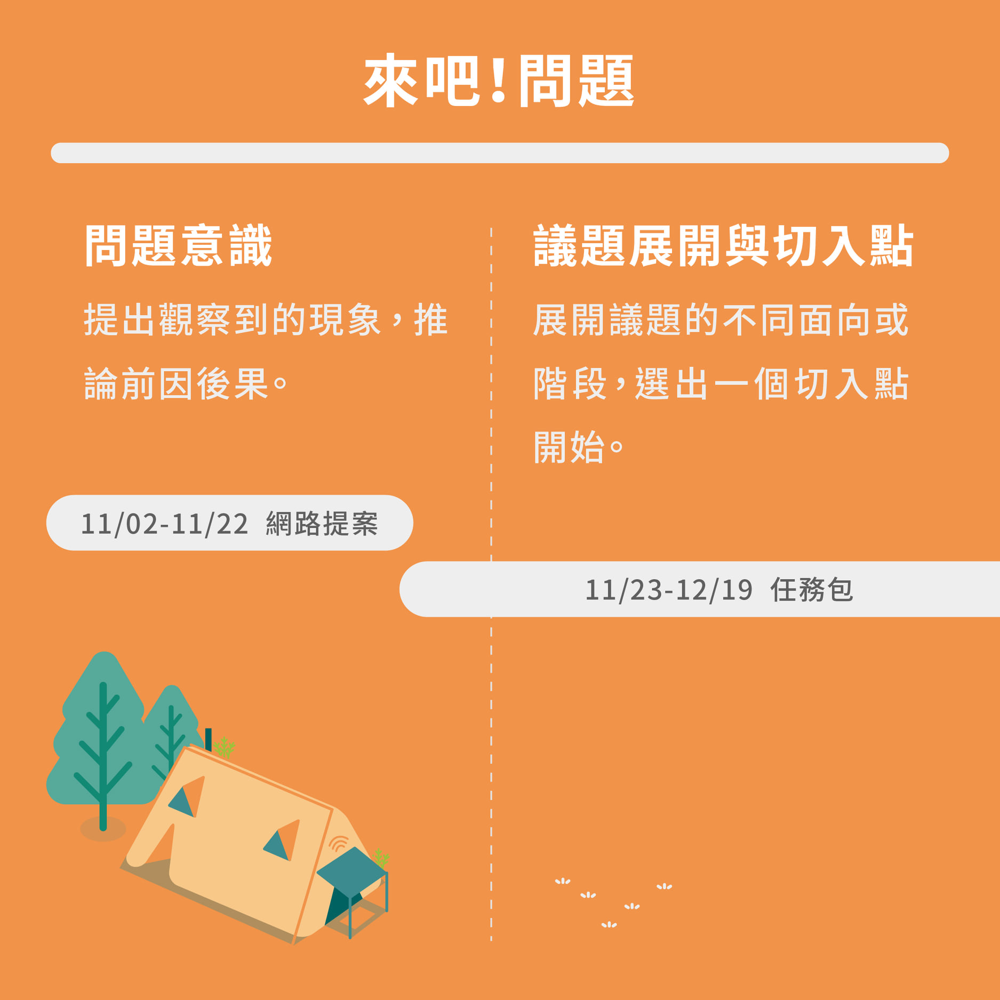

# 【來吧！問題】所有行動始於一句提案。

我們如何承認眼前**感覺怪怪的**，就是一個問題？而這個問題，我該如何闡述、並讓社會大眾同樣認為**這件事值得被討論**？

第一步很簡單，提出問題之後，看見與之相關聯的議題，那麼我們該如何選擇第一個切入點？

### 案例分享 2020 No.172 SAVEE 

#### **第一句提問：我們如何能夠積極預防私密影像外流呢？**

No.172 SAVEE 是關心私密影像外流議題的團隊，經過任務包的引導，與重要的關係人訪談，發現一個極其抽象、卻又關鍵的「感受」。

**重要關係人：**曾觀看外流私密影像的同學、曾受理過私密影像外流案件的警察、以及公民老師。

**發現：**由於年輕族群普遍不了解「私密影像外流」的嚴重性、覺得自己**不具有 「道德制高點」**的立場來阻止散播；  
而教師們即便發現有嚴重性，也會因為「 **難以從現有課綱找到延伸點**」、「**考試導向教學**」、「**修課對象限制**」等因素，造成此議題較難融入現有公民課中，並把正確觀念觸及到每一位學生。

**可執行的切入點：**團隊希望能從「整個社會的第一步」著手行動－－－更著重在「國高中生」對於私密影像外流的預防與法律知識上的補充。

**延續發想的方法：**

* 為了要能夠吸引國高中生，團隊將議題的切入點鎖定在以遊戲化的方式來增加觸及人數
* 從桌遊的設計中，讓國高中生以情境式的方式，\#體驗加害人與被害人的感受，進一步在生活中帶來影響力。

