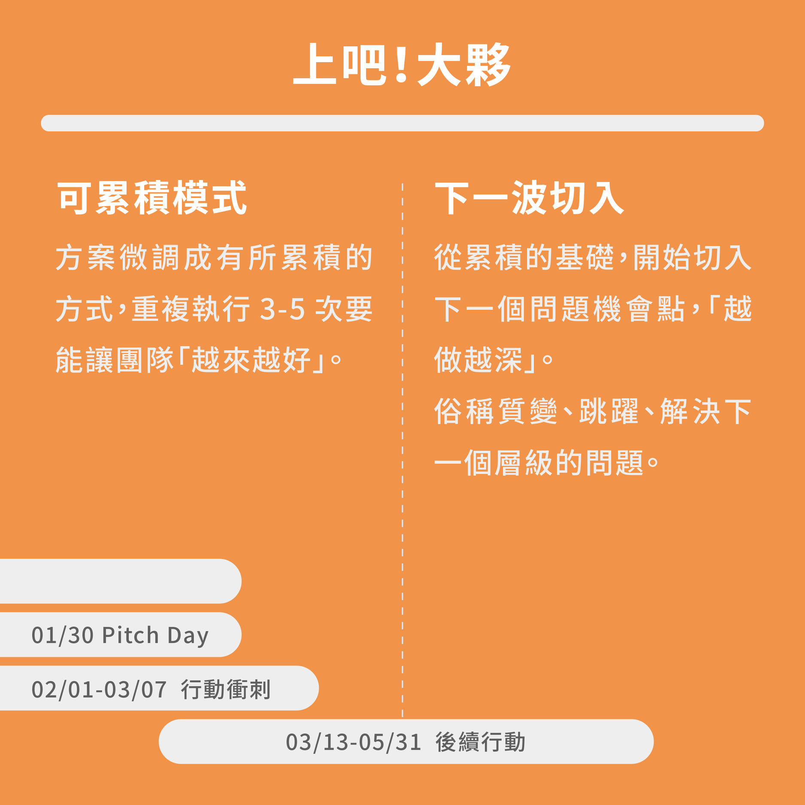

# 【上吧！大夥】我有的是經驗！下一步，就是重複！就是累積！就是再踹！

來，如果你會看到這，讓我們一起好好反思：「為什麼凡事都叫我先給商業模式？為什麼大家都要問我原理？論述？」

 不好意思，青年迴響給的，是行動。 再微小的行動，有用了，我們就來搞懂為什麼。

### 案例分享 2020 No.098 漂泊俱樂部 

No.098 漂泊俱樂部，是一個關心高關懷青少年的團隊，希望能建立高關懷青少年與社會良性互動、對話的橋樑。  
　　  
**行動歷程：**在實驗行動的過程中，團隊嘗試了讓高關懷青少年**與大眾做交換日記**、**觀察高關懷青少年參與一般休閒活動**、 **訪談陪伴過高關懷青少年的組織**等。  
　　  
**收斂的方案：**「共備料理」，讓高關懷青少年在與大眾共同完成料理的過程中，自然而然產生互動與對話，並在完成後一起發送料理給無家者。  
　　  
**大議題裡的關鍵發現：**高關懷青少年，在特別某一種狀況下，比較容易能與人開啟對話：**不是單純為了交流而產生的互動**；  
  
同時，會因為和陌生參與者，有共同要達成的新目標，**會獲得成就感和喜悅**，推測這些感受，都能推動高關懷青少年的意願，有了下一次還想試試看的動能；  
　  
並且，讓陌生參與者，從這樣的活動中，更能以沒有標籤的眼光，自在地認識高關懷青少年，形塑出團隊心目中的良善氛圍。  
　　  
**如何放大？**：確定方案走向後，團隊下一步期待能在共備料理的最前期，號召更多大眾志工一起與高關懷青少年共同設計菜單，擴大能參與互動的大眾數量，也讓更多高關懷青少年能夠有機會與社會開啟良性的對話。

