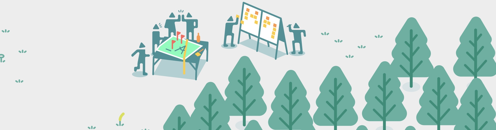

# 迴響品牌紀元

## 「迴響計畫是怎麼開始的？」

#### 「我們如何能鼓勵更多年輕人為自己在乎的事情採取行動？」

2017 年 開始，我們邀請青年一起想像，十年後的台灣是什麼樣子？  
我們能不能募集藏在大家心底那些真實到不敢討論的、認為反正一切都不會改變的問題呢？

最初的口號「給你一個行動的藉口」，想邀請因為現實的無力感而遺落在台灣各個角落的青年，走出螢幕、跳脫空想、放下鍵盤的評論，透過真實的行動來面對心中所關注的議題：從做得到的事情開始，逐步串連至 2027 的改變。

完整的開頭故事，歡迎閱讀：[《行動旅人求生筆記》](https://issuu.com/jarahchou/docs/_____191007____27.3m___)第 38 頁，〈預備，鳴槍起跑〉  

#### 計畫開始的第一年，有幾個特點，刻畫出迴響計畫最主要的模樣

* **以「行動」為核心的孵化計畫：**
  * 想要報名活動，不是填寫一個報名表等待錄取通知，迴響作為一個鼓勵行動的計畫，要報名了，就直接動起來吧！報名活動以任務包取代書面審查，提供你基礎的行動知識跟目標，試著做做看，最早完成的 40 組正式加入當年的迴響計畫。
    * 延伸閱讀：[任務包是什麼？](../zhi-shi-ti-xi/hui-xiang-jin-san-jiao/hang-dong-gong-ju.md) 
* **行動夥伴，一群也期待社會上有更多行動發生的人們：**
  * 一群在社會創新領域 3-5 年的行動先行者。行動夥伴的意見不代表正解，而是陪著團隊一起找答案。提供團隊具體的行動經驗、人脈資源還有社群影響力，幫助團隊降低行動的門檻，以及提供往前衝的勇氣
    * 延伸閱讀：[行動夥伴](../zhi-shi-ti-xi/hui-xiang-jin-san-jiao/hang-dong-huo-ban.md) 
* **三大精神，持續行動的基本信念**
  * 第一年的行動工具沒有那麼完整，但我們相信有些信念可以指引著大家持續前進，直到目前，這些精神都還是繼續沿用著。
    * 延伸閱讀：[迴響三大精神](../zhi-shi-ti-xi/hui-xiang-san-da-jing-shen.md) 
* **以青年為本的實體活動：**
  * 像是：大會師的入場 Read Me First 寫著：「今天沒有規定，沒有非如何不可的事情，所有你靈光一閃想到可以做的事情，都可以做，所有你不想做的事情，都可以不做。」 
* **協助青年行動的具體方法：**
  * 第一年以設計思考、精實創業為基礎，指引了迴響計畫的不同階段，每年，我們也會依照實際的狀況持續的迭代行動的架構設計。
    * 延伸閱讀：[行動架構設計](../zhi-shi-ti-xi/hang-dong-jia-gou-she-ji.md) 
* 行動節：

## 每年，我們也是行動的團隊之一，持續嘗試計畫的不同可能性

以下，簡短摘要每屆的一些嘗試亮點，若你也動了類似的念頭，歡迎聯絡我們聊聊具體的經驗

~~（以下想要分別列出不同的嘗試，不管成敗，然後都以「成就」、「學習」來收尾）~~

### 2018 年，是\_\_\_\_\_的一屆

* 調整隊伍數到 30，不限於 10 組，每年可以協助更多團隊突破最模糊的階段
* 大幅增加教練團的人數，提升工具真的被使用，也更知道團隊的實際運作狀況
* 行動節 → 做到\_\_\_\_曝光，促成很多的對話，但不是所有團隊都最需要的，卻需要團隊很多的心力
* 積分制 → 希望促成公平，卻讓整體機制變得過於複雜
* 行動迴圈開始變得清楚

### 2019 年，是取捨的一屆

這年，計畫的預算相比過去下降的許多，我們在有限的資源下，要很努力的看到真正核心的東西是什麼。當然，得知消息的當下有很多的失望與挫折，但回顧起來，卻是協助我們踩穩的一年。

* **任務包線上課程：**
  * 任務包一年可以協助 40-70 組團隊採取行動，順著不知道未來的氛圍，乾脆把任務包的核心知識錄製成線上課程，未來如果有什麼變卦，還可以持續發揮影響。隔年再推了一把，把工具公開化。 
* **沒有獎金的 Pitch Day：**
  * 沒有獎金預算的 Pitch ，反而讓我們更仔細的思考團隊的需求，將團隊分成三種類型，反而讓團隊與評審不需要互相推測狀況，更深刻的在感性上、資源上能連結。
    * **噴射者：**團隊動能、專案狀況都樂觀，需要的是明確特定的資源協助
    * **堅韌者：**遭遇到許多挑戰，但是還想要繼續前進，需要的是議題專家的連結與方向的指引
    * **靜思者：**再深入議題後，發現狀況跟想像的真的不一樣，現階段想暫停行動，需要的是對過去行動經驗的整理。 
* **第一次迴響同學會**：
  * 半開玩笑的在最後一場活動抽籤兩組團隊，實際上真的發生囉！讀到這裡的迴響校友，要不要一起舉辦下一場啊？ 
* **迴圈工具包**：
  * 當年把行動迴圈對應的工具都開發出來，還做了一個 [工具網站](https://rethinktaiwan2027.wixsite.com/rethinktaiwantool) 的雛形

### 2020 年，是嘗試與世界連結的一屆

與世界連結的意思是，過往的迴響似乎踩在一種得天獨厚的環境，所有的嘗試都是我們的「想要」，但今年的執行考量了更多「未來延續」、「迴響以外的可能」

* **以多年使用的維度來打造的網站：**[**https://www.rethinktaiwan.com/**](https://www.rethinktaiwan.com/)\*\*\*\*
  * 過往官方網站，因為光是要製作出來已經耗費執行團隊大量心力，今年終於下定決心，也把沿用性考慮進去，或許對逛網站的人體驗差不多，但對執行團隊來說，可是每年會省下大量心力的。 ****
* **開發任務包線上軟體**：
  * 過往的任務包就是一些 google 線上共編、pdf 檔案傳來傳去，這年把整個體驗移動到一個網站上，讓資料的連貫性、教練回饋是更流暢的。你也可以在[公開化的任務包](../zhi-shi-ti-xi/hui-xiang-jin-san-jiao/hang-dong-gong-ju.md)體驗看看。 
* **開發迴圈工具包線上軟體：**

  * 迴圈包線上化的成果就沒有任務包來得樂觀。這個階段不同團隊間的需求差異較大、迴圈包工具本身的架構過於清晰，其實只有少數團隊是仰賴這麼清晰的邏輯分析來行動的，有時候，反而讓團隊不要想得那麼清楚，趕快行動，會更有收穫。迴圈包工具經過兩年的嘗試，我們判斷這更適合為「教練的工具」，判斷團隊的整體狀況，而不需要每個團隊都需要如此有邏輯的工具。

* **眾力小宇宙的嘗試：**
  * 過往迴響大概是 3-4 個月的期程，而持續行動團隊的下個階段，一個常見的模式是號召更多響應者參與議題推動，於是今年有關於這整個階段的方法、課程、議題團隊的嘗試。嘗試的結果是：這個領域的確是能協助團隊有效行動的，但回到團隊這個階段真正的需求，或許不需要急著在行動的進度上推進，而是需要有機會可以整頓團隊動力、先把一些已知的事情做得更多次來建立自信與團隊穩定度。

