# 迴響行星群

迴響星球第一次被整理並展示出來，是在 2018 年的行動節。十五顆星球，代表迴響文化的十五個精神。這些是出人意料地，既純粹又簡單的概念，甚至有點老掉牙；不過更重要的是，它們一直都存在在迴響的文化裡。

不論你是否見過它們，希望此刻回顧這片星空的你，能遇見觸動你心底的那顆星球。

|  |  |
| :--- | :--- |
|   | **真誠 Honesty**  「真誠是與這個世界溝通的基石。」  真誠是不貪心，不去假裝自己沒有的東西，不去武裝心底其實覺得不對的事情，真誠是開始樂意擁抱自己。迴響重視的價值是，你是否清楚明白，面對這個世界，其實自己已然具足，毋須更多妝點了。 |
| 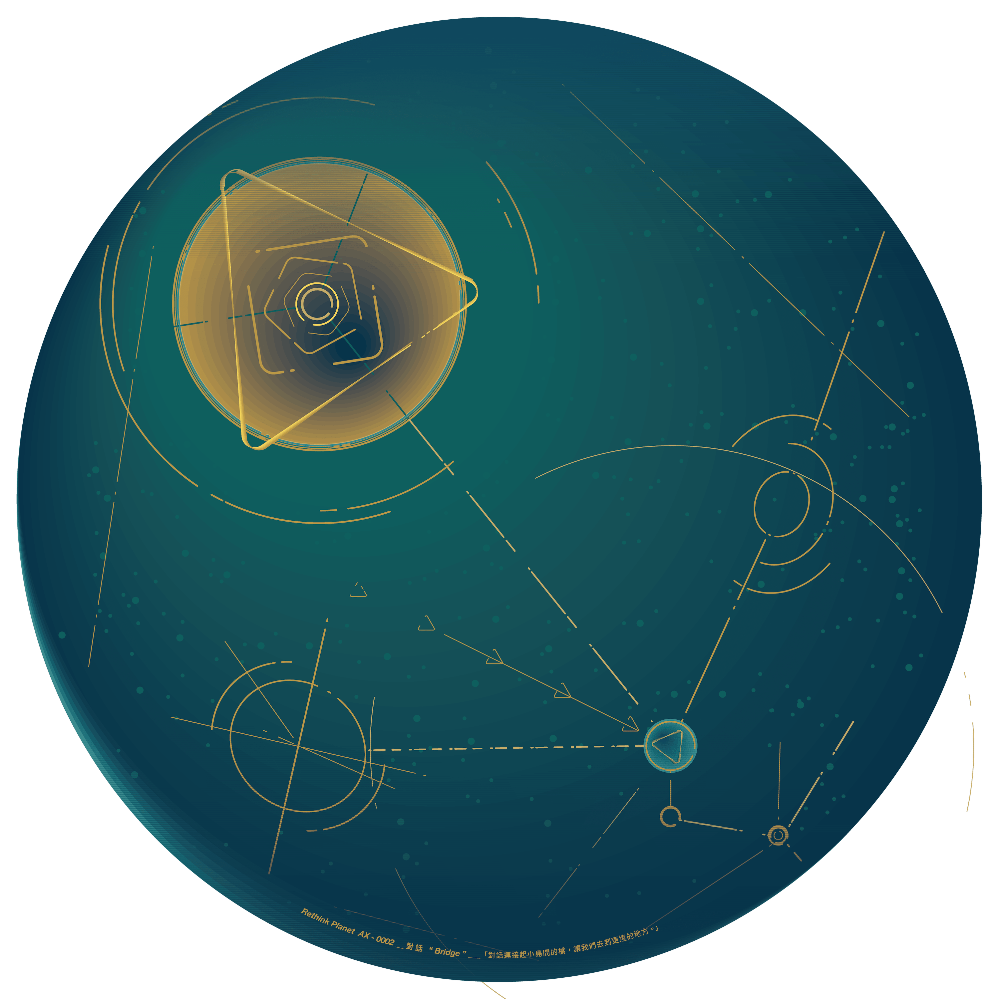  | **對話 Bridge**  「在小島間搭起橋樑，讓彼此去到更遠的地方。」  對話，是與一部分的自己和解，是瞭解自己其實有盲點，是承認自己的不足，對話是接受我們需要對方。迴響相信的價值是，不知道該怎麼辦的時候，選擇對話比選擇隱瞞還要有效，講清楚、說明白就好。 |
| 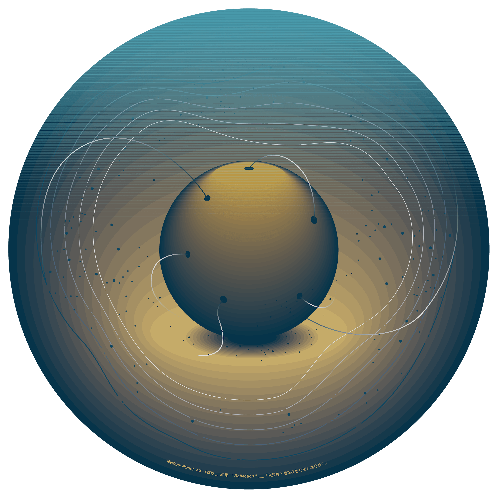  | **反思 Reflection**  「我是誰？我正在做什麼？為什麼？」  反思，是以採取下一步行動為前提問自己問題，是認真看待過去的時間，是開始懂得為明天作準備。迴響重視的價值是，在每一個當下，清楚手段、目的、情緒和原因。 |
| 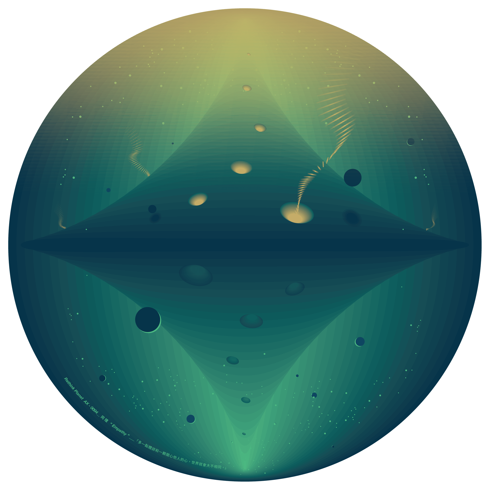  | **同理 Empathy**  「多一點體諒和一顆關心他人的心，世界就會大不相同。」  同理，是想盡辦法向對方那邊靠近，不為任何其他附帶的目的，回到人和人之間的關係，不特別求方法、不執著用工具。迴響重視的價值是，面對面時注意，我們是更靠近他人，還是更靠近我們自己。 |
| 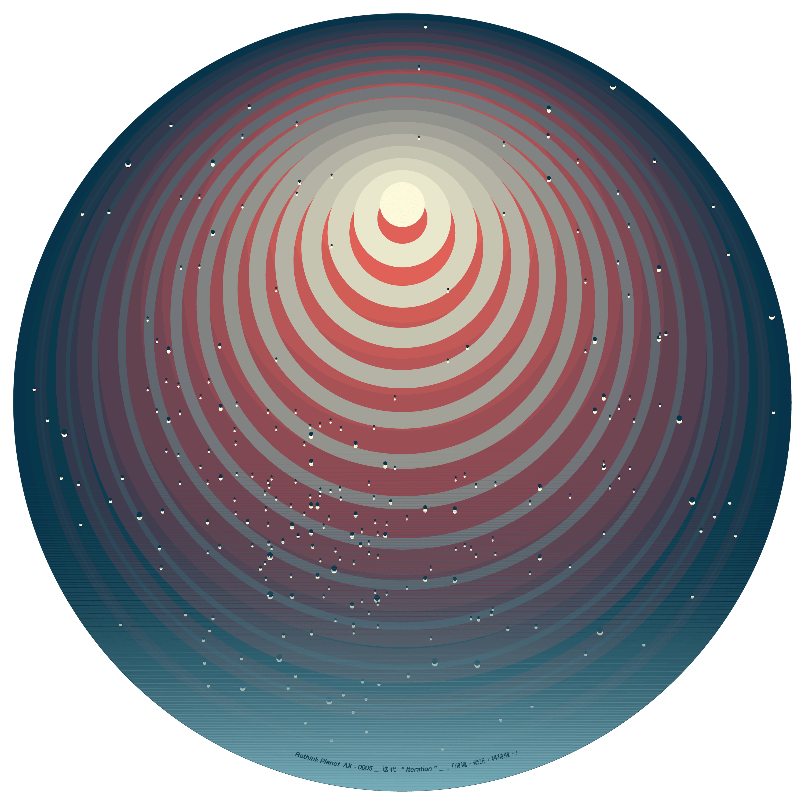  | **迭代 Iteration**  「前進，修正，再前進。」  迭代是懂得擁抱每一個不完美，是與伙伴一起前進的秘密咒語，不費力去獨佔片刻的成就，不刻意去責怪當下發生的問題。迴響重視的價值是，我們一起變的更好，或者，我們一起變的更好，你二選一。 |
| 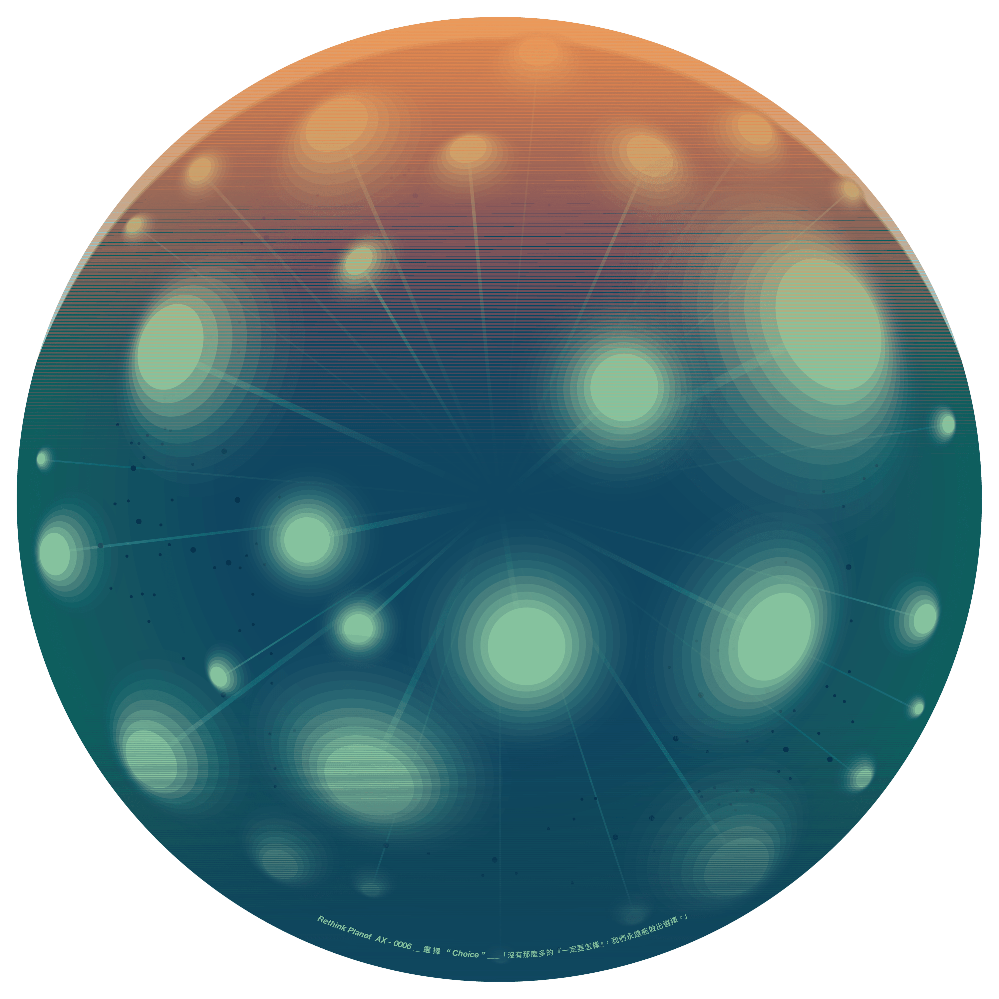  | **選擇 Choice**  「沒有那麼多的『一定要怎樣』，我們永遠能做出選擇。」  選擇是靠近自由的宣告，是責任的起點，是起跑的哨音。迴響相信的價值是，在困頓時記得你仍有所選擇，特別是在那些爭執中的第三種選擇。 |
| 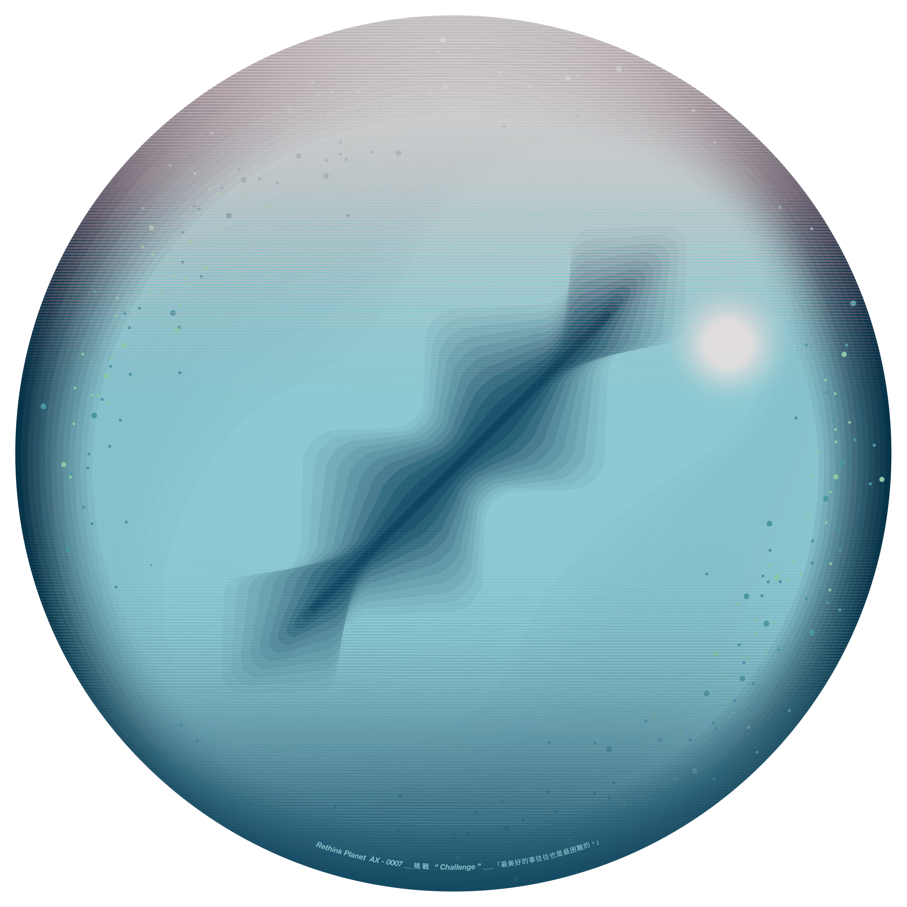  | **挑戰 Challenge**  「最美好的事往往也是最困難的 。」  挑戰是把自己跟更大的系統連接起來，是相信每一個當下都只是「小局」，把大局放在心裡，那些張牙舞爪的東西，就會變成西瓜或香蕉皮，吃掉或者乾脆繞過去。迴響重視的價值是，面對挑戰，懂得把自己變大，也能夠把自己縮的很小。 |
| 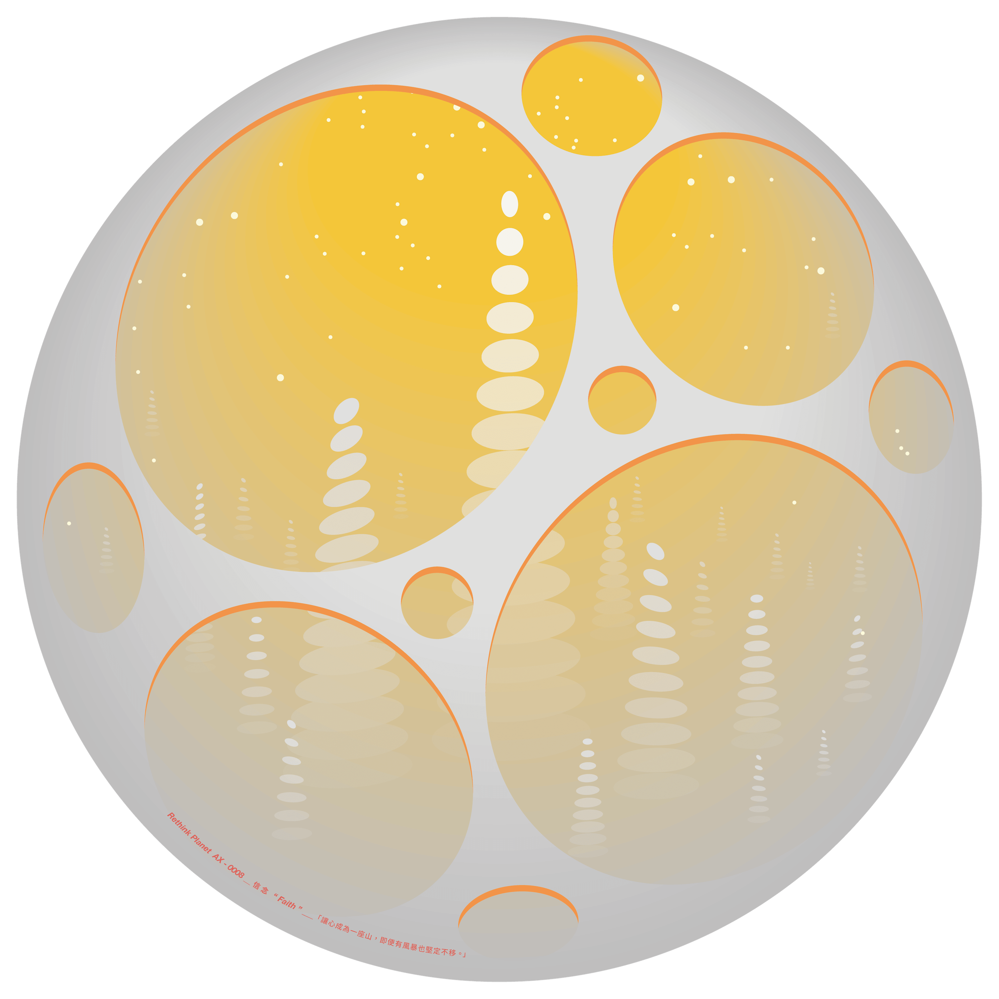  | **信念 Faith**  「讓心成為一座山，即便有風暴也堅定不移。」  信念是不再執著於尋找答案，是所有為什麼最後的解釋，是看不見光的時候，鑿穿一個孔的小槌子。迴響重視的價值是，為大於你自己的東西努力，看見終點之後的終點，相信我們最終都會到達。 |
|   | **溫柔 Kindness**  「善待人的不完美，尤其是那些與自己不同的地方。」  溫柔是選擇看見對方的不安、疑慮和恐懼，造一池冷熱適中的溫泉，讓對方泡進去放鬆而渾然不覺。迴響相信的價值是，無論順境或逆境，我們都學著保留一點餘裕，放慢腳步，對彼此溫柔一些。 |
| 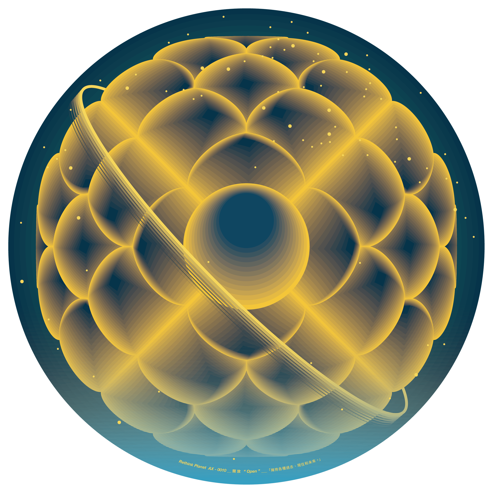  | **開放 Open**  「擁抱各種過去、現在和未來。」  開放是牽好自己邊境的牧羊犬，任他吠叫，也要和上門的未來點點頭，好好招呼現在的需求，讓過去的執著經過。迴響相信的價值是，打開門來，邀請他們，該留的會留，想走的會走。 |
| 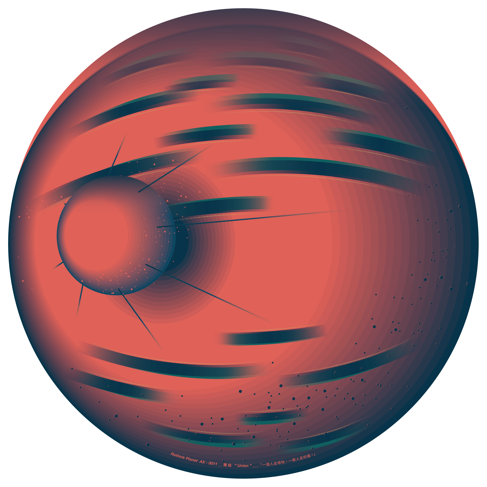  | **團結 Union**  「一個人走得快，一群人走得遠。」  團結是地球超人的戒指，是被投觸身球時大家一起衝上去，是等最後一個人吃完飯，是隨時注意大家在哪裡。迴響重視的價值是，可以的話常把「我們」放在心上，不覺得那是別人的事情。 |
| 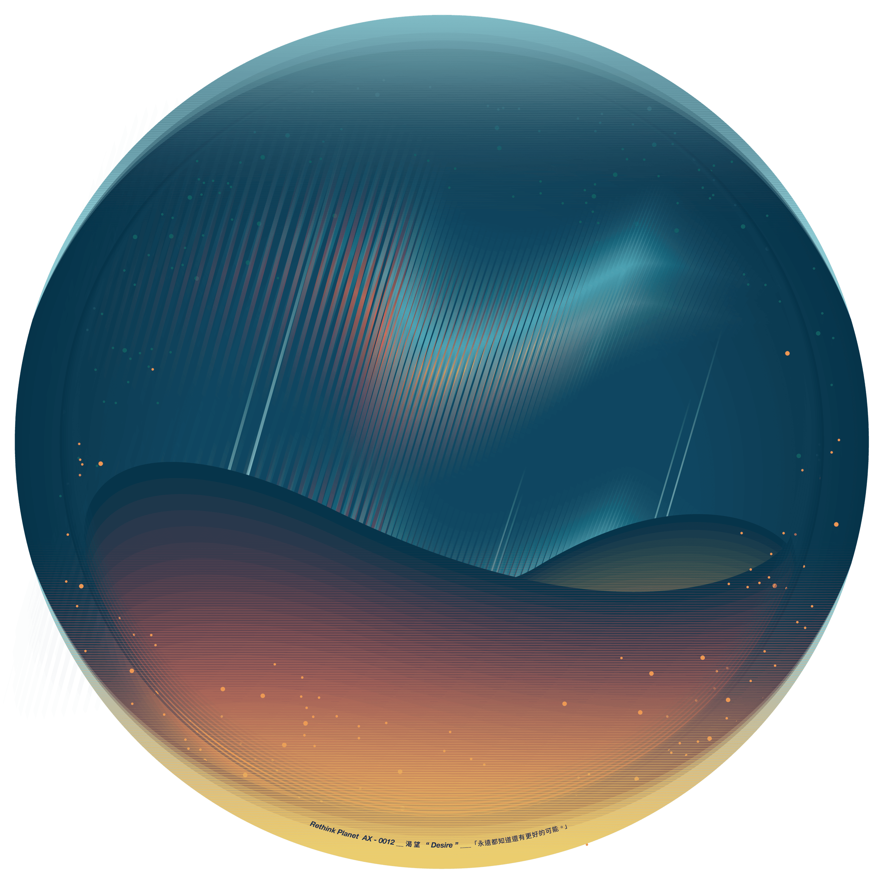  | **渴望 Desire**  「永遠都知道還有更好的可能。」  渴望，是因為撞見未來而興奮不已。你也有未來突然變的透明清晰的時刻麼？想像力從渴望中迸發，還未發生的場景一幕一幕飛馳而過，好像你立時擁有了什麼一樣。迴響重視的價值是，心無悸動時退後一步，看見最初的渴望在哪裡，用帶著心跳的行動連結未來和現在。 |
| 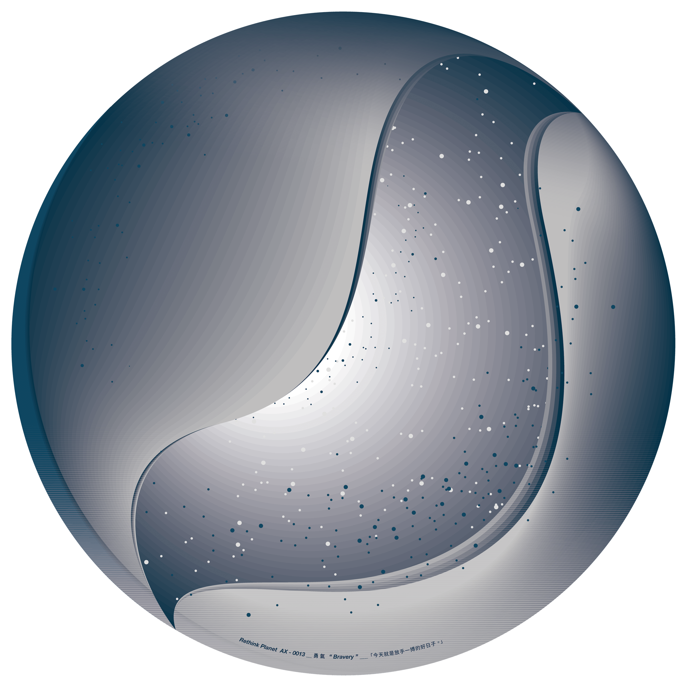  | **勇氣 Bravery**  「今天就是放手一搏的好日子。」  勇氣，是一種跨越限制的狀態，是在喜歡的人面前誠實，是在龐大的壓力下還能走的坦蕩。迴響重視的價值是，請求准許不如請求原諒，覺得該做的事情，定有屬於你的原因，出發是選擇放下限制，由別人加諸的，留給其他人去遵循。 |
| 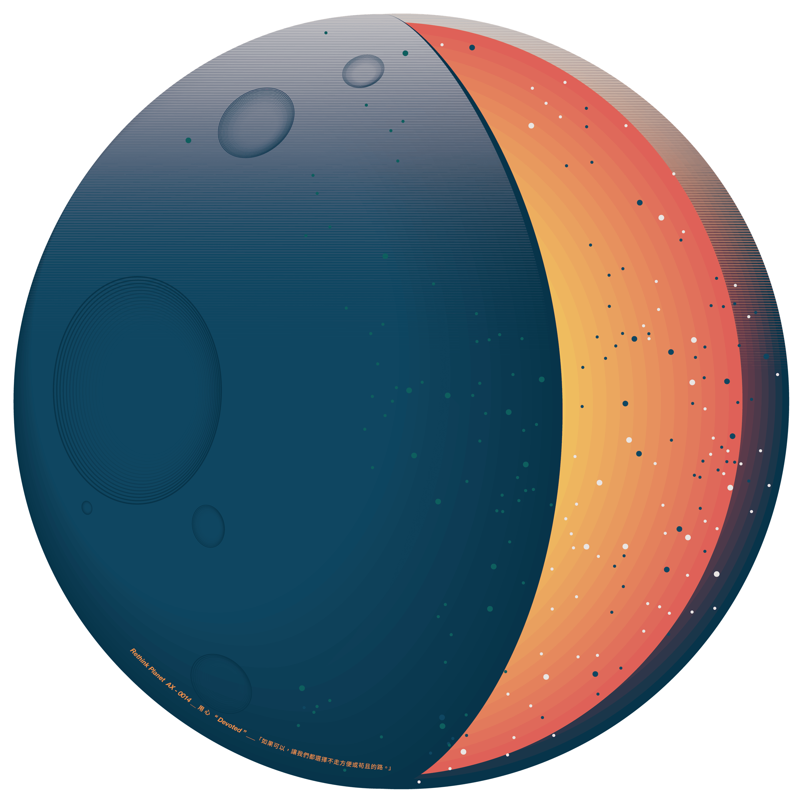  | **用心 Devoted**  「如果可以，讓我們都選擇不走方便或苟且的路。」  用心是看見了什麼在意的事情，不別過頭去，是相信這一時一刻只有我們，不能重來也無法回去。迴響重視的價值是，不心存僥倖。 |
| 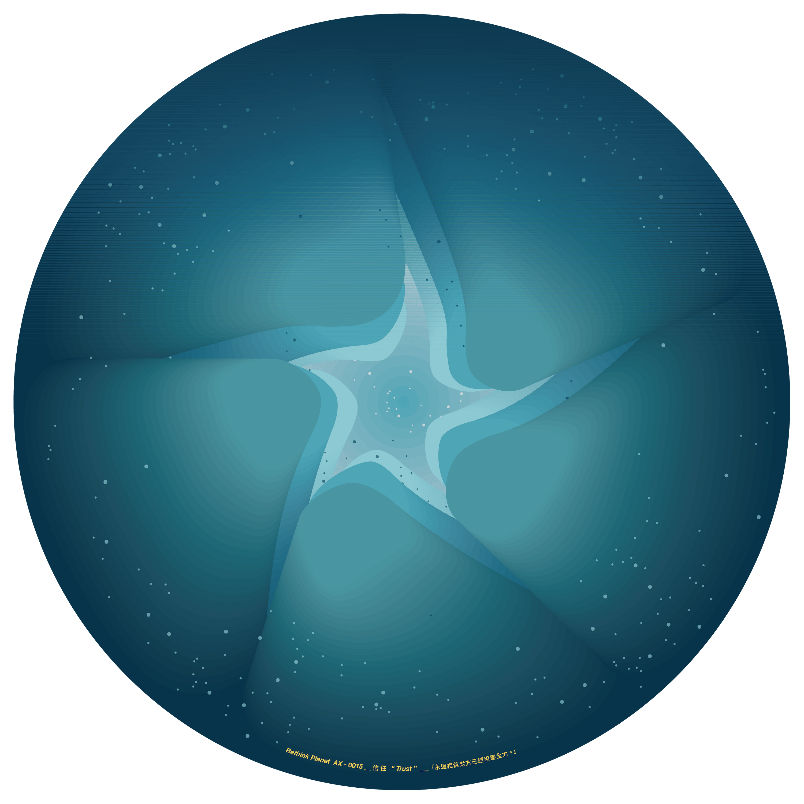  | **信任 Trust**  「永遠相信對方已經用盡全力。」  信任是不再踽踽獨行，是把一部分的自己交出去，像雀巢檸檬茶的廣告，可以張開雙臂躺下去。迴響相信的價值是，質疑不會讓事情推進，接受然後靠近，才能一起解決問題。 |



